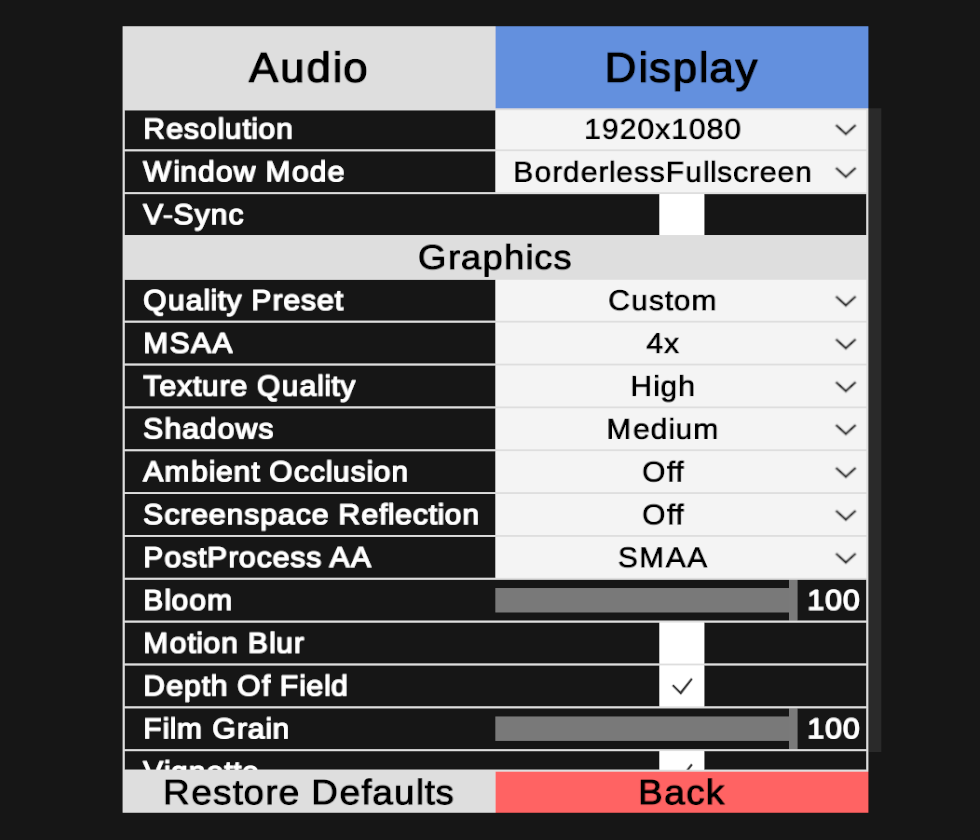
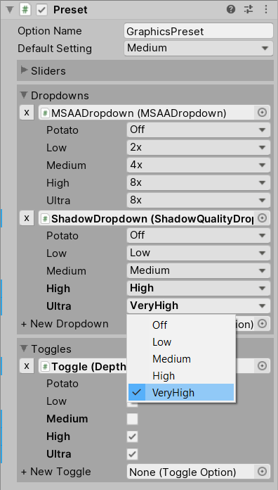
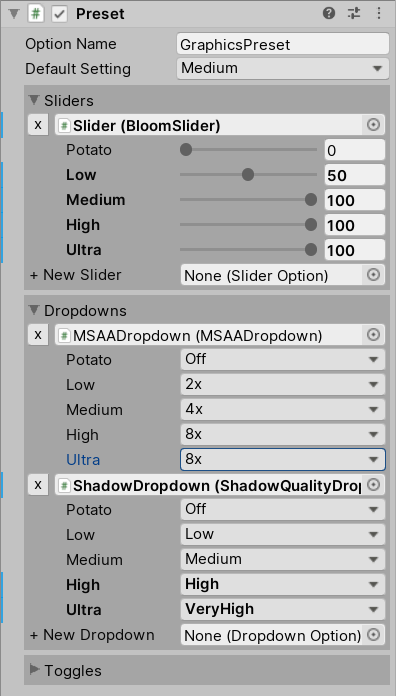

# Modular Options Menu


A menu template and underlying system for use in the game engine Unity.

This project aims to help users avoid the pain often involved in haphazard, hardcoded menu systems developed due to time-constraints or lack of interest.

## Features
* **Fully modular** - All options can be used by themselves or in any combination, without the need to ever touch the code.
* **Easy to use** - Editor scripting automatically assigns variables for you and displays data in a user-friendly way.
* **Flawless performance** - Entirely event-based. No part in the project has continuous execution (like `Update()`).
* **Highly flexible menu template** - Easily changed and expanded. Adding a new option can be completed in seconds!
* **Full controller and keyboard & mouse support** - All parts of the system support navigation in whichever way the user finds suitable.
* **Lots of included options** - About 30 reference option implementations provided in the package.
* **Easily extensible** - New option scripts can be created with just a few lines of code! Literally 1 line of code (excluding class and function declaration) if you don't need references.
* **Supports external Assets** - All options support TextMeshPro and reference option implementations are included for [PostProcessingStackV2](https://github.com/Unity-Technologies/PostProcessing) and [Aura](https://assetstore.unity.com/packages/tools/particles-effects/aura-volumetric-lighting-111664).
* **Support for URP and HDRP** - The Render Pipelines are still in development, with incomplete functionality, but reference implementations for most of the post-processing effect controls are included.
* **Lots of utility scripts** - UI interaction sounds, slider value display, scene reference attribute and more included.
* **Compact** - The entire project is less than 1 megabyte in size as it consists of nothing more than code and prefabs.

## Installation
Just unpack the Zip file into your Assets folder. After that just add the MenuTemplate prefab to your scene, or create your own and start working.

### Supported Unity versions
The menu template uses Unity's new prefab system, which requires 2018.3 to function.
Other than that most of the scripts should work all the way back to even version 5.

## How to use
Most information can be gleaned from the MenuTemplate, so it's highly recommended to give that a look.

The option classes should be added on the same GameObject as the UI-element they are supposed to work with. Then just add any external references needed by the option (e.g. PostProcessing options require references to profile assets containing option data).

That's it. You now have a working option. Configure the values presented to the user through the UI-element class(e.g. Dropdown) itself, and set the default value in the option class, along with any potential option-name changes you wish to make.

Now for the more fancy part: OptionPresets allow you to change any number of options through a single one. All options (except a few screen-related ones intentionally excluded) can be added to OptionPresets. Set up your options as you normally would, then reference all the Options you wish to control with the preset. The menu template contains a graphics preset you can look at for illustrative purposes. The OptionPreset class has a custom Editor to make keeping track of values easier. It exclusively uses SerializedProperties, and should handle data like any native Unity property in the Editor. Example images of the custom Editor:



If you wish to include added options in the Restore Defaults Button you can either manually add these or clear and automatically add all the found options by clicking the cog-icon on the RestoreDefaultsButton and clicking "Auto-Fill Parent-Sibling Options" (success depends on menu hierarchy).

## Changing save-system
The system uses Unity's PlayerPrefs by default. This can be swapped by changing 2 lines of code in DropdownOption, SliderOption and ToggleOption, and 1 in the SaveButton script. The easiest way of achieving this is simply to do a project-wide search for "PlayerPrefs" in your code editor and swapping the found occurrences.

## Extending the system
If you already have public properties or functions for manipulating the option values in your scripts you can make use of the ExternalOptions. The only requirement is that the function/property accepts the data-type used by the UI-element as input (float for Sliders, int for Dropdowns and bool for Toggles). Just click the + button on the ExternalOption, drag a reference to the class you wish to modify and select the function that modifies the option, just make sure you're using the Dynamic float/int/bool version of the function to properly pass on the input value.

If you lack these public properties/functions or simply wish to have dedicated option classes, you can easily extend the system by inheriting from one of the 3 option base classes: `SliderOption`, `DropdownOption` and `ToggleOption` (all part of the `ModularOptions` namespace). Which is done by replacing `MonoBehaviour` in the script with one of those 3.

**Basic structure of an option script:**
```cs
public ClassToModify reference; //Assigned through the UnityEditor

protected override void ApplySetting(float _value){
	reference.value = _value;
}
```
If you need to grab the `reference` through code you should do so in the `Awake` function, like this:
```cs
protected override void Awake(){
	reference = CodeThatReturnsReference();
	base.Awake();
}
```
Being careful to call the `base.Awake` function after to ensure proper initialization.

**But ultimately, the easiest way to create new option scripts is simply to copy existing option scripts** with the functionality you want and just changing which values it modifies. All the basic option structures are present in the reference implementations included:

[TextureResolutionDropdown](Scripts/DisplayOptions/TextureResolutionDropdown.cs): standard DropdownOption.

[AmbientOcclusionDropdown](Scripts/DisplayOptions/PostProcessing/PostProcessingStackV2/AmbientOcclusionDropdown.cs): DropdownOption where the option has a separate variable controlling 'On'/'Off' state; index 0 acts as 'Off', while the rest of the options are populated by enums.

[FieldOfViewSlider](Scripts/AudioOptions/FieldOfViewSlider.cs): standard SliderOption, with comments on how to override slider text formatting.

[BloomSlider](Scripts/DisplayOptions/PostProcessing/PostProcessingStackV2/BloomSlider.cs): SliderOption where the option has a separate variable controlling 'On'/'Off' state;  0 acts as 'Off'.

[VSyncToggle](Scripts/DisplayOptions/VSyncToggle.cs): standard ToggleOption.

## Tips & Tricks
* Setting up explicit navigation is recommended if you have enough options to make menus activate scrolling as Unity's Automatic navigation can be wonky.

Copyright © 2020, Karl Ramstedt